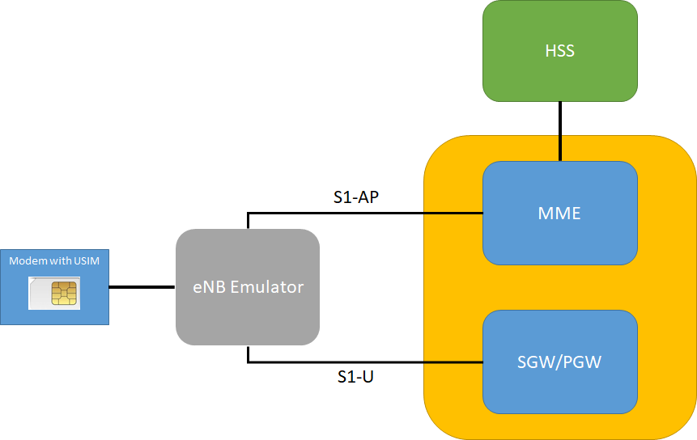
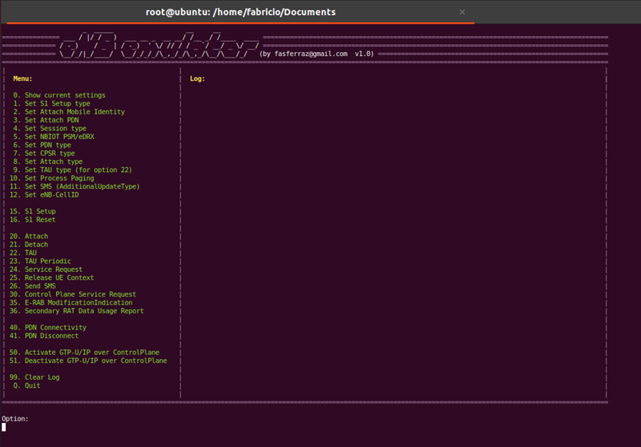

# eNB s1 Emulator


This is an eNB emulator application done in python3 to interact with MME (S1AP) and SGW (S1-U). 
This application can be used to perform and simulate several EMM and ESM procedures, including user plane traffic.
This application was tested with real MMEs (lab environment).



You have the capability to use a modem to perform external authentication with USIM.
The modem needs to support the AT commands AT+CRSM and AT+CSIM. You can define the ttyUSBx to use in the options (-u).
Note: If no modem is used a default KASME and XRES are used (check corresponding valiables inside *session_dict_initialization* function).

I had previously done some experiments with SCTP using the native socket module from python3, but starting a ASN.1 module for S1AP from scratch was a big challenge. Fortunately I found some magnificent python modules for ASN.1 and S1AP done by P1 Security that I highly recommend:

https://github.com/P1sec

They have plenty of modules for almost anything related to Mobile Developments, but for my project i just used the S1AP from pycrate_asn1dir module, and CM from the CryptoMobile module (that has all the ciphering and integrity protocols needed for NAS). 
In order to derive the integrity and ciphering keys from KASME/CK/IK) i used another module: the Crypto.Hash (pip3 install pycryptodome) that has the HMAC and SHA256 functions needed for KDF.
For serial communication towards the modem I use the pyserial module (pip3 install pyserial)

So in resume, these are the required external (non-standard) modules:

```
import serial
from pycrate_asn1dir import S1AP
from pycrate_asn1rt.utils import *
from CryptoMobile.CM import *
from Crypto.Hash import HMAC
from Crypto.Hash import SHA256
```

Many variables needed for SA1P and NAS are defined inside the *session_dict_initialization* function. 
You can change them to meet your onwn needs.

When you call the scritp these are the options available:

```
python3 eNB_LOCAL.py -h
Usage: eNB_LOCAL.py [options]

Options:
  -h, --help            show this help message and exit
  -i ENB_IP, --ip=ENB_IP
                        eNB Local IP Address
  -m MME_IP, --mme=MME_IP
                        MME IP Address
  -g GATEWAY_IP_ADDRESS, --gateway_ip_address=GATEWAY_IP_ADDRESS
                        gateway IP address
  -u SERIAL_INTERFACE, --usb_device=SERIAL_INTERFACE
                        usb tty (e.g /dev/ttyUSBx)
  -I IMSI, --imsi=IMSI  IMSI (15 digits)
  -E IMEI, --imei=IMEI  IMEI-SV (16 digits)
  ```
 
Nota: Gateway IP Address (option -g) is needed when the MME or SGW are not in the local LAN, or when you have multiple interfaces. With user plane activated, the default route points to a tunnel interface, so this gateway IP Address is needed so that MME address and SGW address are also reachable (using /32 routes) using this IP as next-hop address

This is the application user interface, where we can see the current options and procedures supported:
  
  
  
This application implements S1-U, so after an sucessful Attach with PDN Connectivy activation, you can use the laptop applications (browser, terminal, etc...) to send/receive traffic over the GTP-U connection towards the SGW using the session IP address, using a tunnel interface.

In case the session is a NB-IoT session you can also send the user plane over NAS.

The basic flow could be for example, option 15 - to bring up the s1 interface, and then option 20 - to perform attach.


The application supports currently the following options:

- S1 Setup type: LTE, NB-IoT, or both
- Mobile Identity Type: IMSI or GUTI
- Attach PDN: Default APN, or Specific APN
- Session Type: 4G, 5G or NB-IoT
- NB-IoT Session Type: No PSM and eDRX, PSM, eDRX or both PSM and eDRX
- PDN Type ipv4, ipv6 or ipv4v6
- Control Plane Service Request with Radio Bearer or without Radio Bearer
- Attach Type: EPS Attach or Combined EPS/IMSI Attach
- TAU Type: TA Updating, Combined TA/LA Updating or Combined TA/LA Updating with IMSI Attach
- Process Paging: Enabled or Disabled
- SMS Update type: Additional Update Type SMS Only: False or True
- eNB Cell can change

In terms of procedures, the application supports the following ones:

- S1 Setup Request
- S1 Reset
- Attach
- Detach
- TAU
- TAU Periodic
- Service Request
- UE Context Release
- Send SMS (a predifined one)
- Control Plane Service Request
- E-RAB Modification Indication
- Secondary RAT Data Usage Report
- PDP Connectivity
- PDN Disconnect
- Activate/Deactivate GTP-U for Control Plane
- Activate/Deactivate Data over NAS
  
  
  
  
